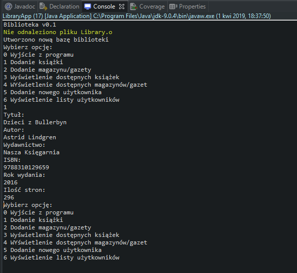
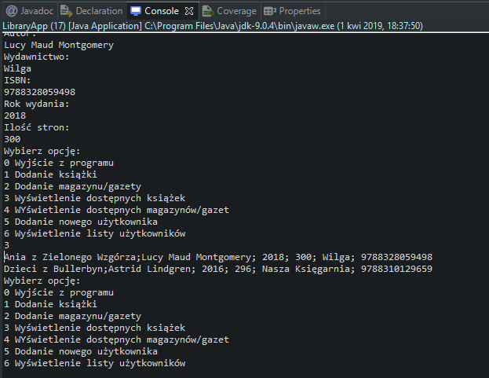

# Library
> The console application allows you to manage a library saved in a file, created with JavaSE 9.

## Table of contents
* [General info](#general-info)
* [Screenshots](#screenshots)
* [Technologies](#technologies)
* [Status](#status)

## General info
The application was created to improve knowledge through the training.

Available functionalities:

adding new books,
adding new magazines, newspapers,
displaying available books
displaying available magazines, newspapers,
adding new users,
displaying existing users.
The library is saved to a file when the application is closed.

## Screenshots

## Technologies
* JavaSE - version 9.0.4

## Status
Project is: _finished_
